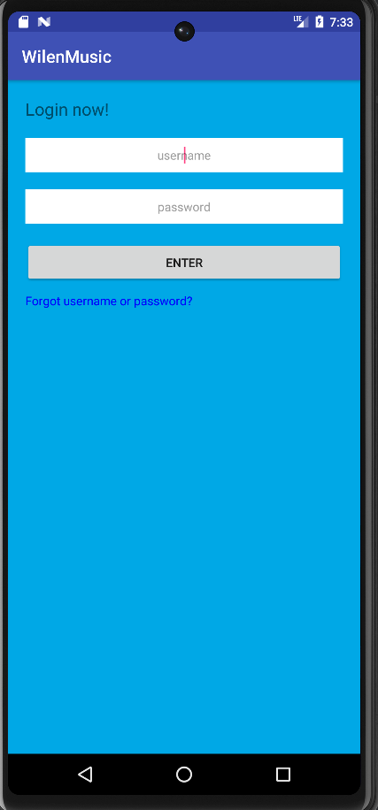

# WilenMusic
## General Information
I did this app during my high school as part of my 10 units in computer science in my "Bagrout exams".
The app allows the user to enjoy a wide variety of music styles.
The app Allows ranking of the different artists and as a result of the rating offers the user additional songs by the artist he liked
additionally,the user can also see the artists he liked as well as the amount of songs he liked from each artist

## Setup
1. Clone this repository  
```
https://github.com/EtaiWil/WilenMusic.git
```
2. go to device manager on Android studio then chose ``` Create device ``` 
3. download virtual device (I used Android 7.0 API 24)
4. press the ``` Run app ``` or ``` Shift +f10```

### Screenshots

#### Home Page Activity


#### Register Activity


#### Log in Activity

#### Song Activity 

#### preference  Activity 


## Built With
- Android Studio
- SQLite


## Author
**Etai Wilentzik**

- [Profile](https://github.com/EtaiWil )
- [Email](mailto:etaiwil2000@gmail.com?subject=Hi "Hi!")
- [LinkedIn](https://www.linkedin.com/in/etai-wilentzik-b5a106212/ "Welcome")

## Support 🤝
Contributions, issues, and feature requests are welcome!

Give a ⭐️ if you like this project!


